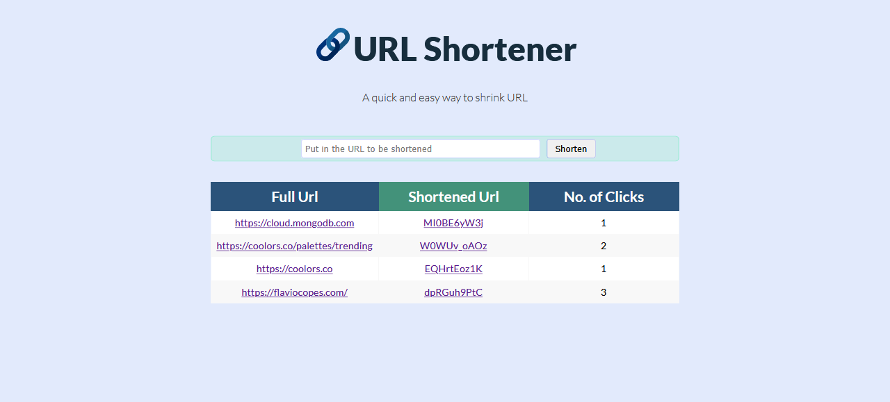

# URL-Shortener
A URL shortener using Node, Express, MongoDB and EJS



---

## Learning Resources 


### Mongoose Functions

**`Model.create()`** - Shortcut for saving one or more documents to the database. 

Alternative to using Model constructor and then saving the document using `save()`

```javascript
// Insert one new `Character` document
await Character.create({ name: 'Jean-Luc Picard' });
```

**`Model.findOne()`** 

https://mongoosejs.com/docs/api.html#model_Model.findOne

```javascript
// Find one adventure whose `country` is 'Croatia', otherwise `null`
await Adventure.findOne({ country: 'Croatia' }).exec();
```

**`Document.prototype.save()`**

https://mongoosejs.com/docs/api.html#document_Document-save

```javascript
product.soldDate = Date.now();
product = await product.save();
// If save is successful, the returned promise will fulfill with the document saved.
```

---

https://stackoverflow.com/questions/23259168/what-are-express-json-and-express-urlencoded/51844327

https://github.com/WebDevSimplified/url-shortener